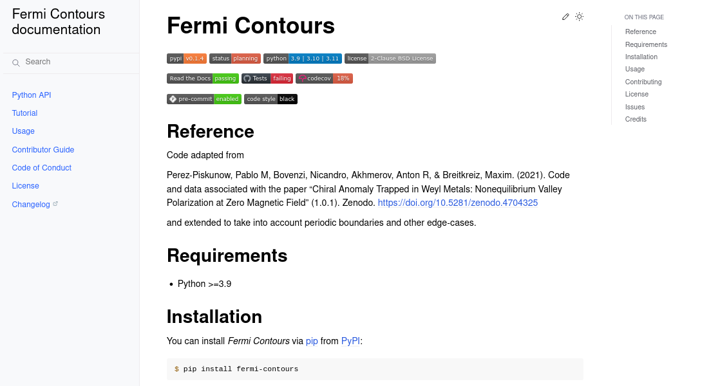
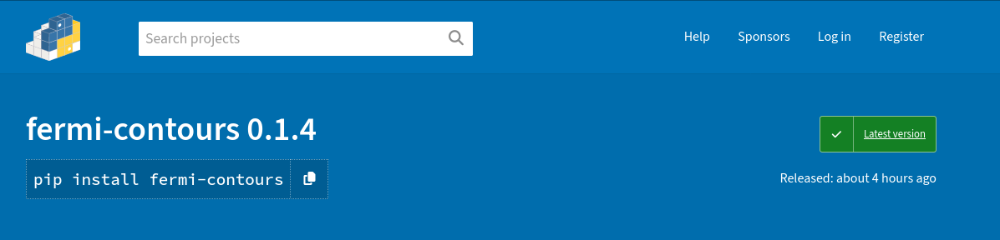

## Deep Dive into Cookiecutter Hypermodern Python with 'Fermi Contours'

Developing 'Fermi Contours' with the [Cookiecutter Hypermodern Python template](https://github.com/cjolowicz/cookiecutter-hypermodern-python) offered insightful experiences in Python package development.

### Emphasizing the Benefits

- **Automated Documentation**: The template's integration with ReadTheDocs and nbsphinx for Jupyter Notebook examples streamlined documentation. This made [Fermi Contours documentation](https://fermi-contours.readthedocs.io/en/latest/) more dynamic, interactive, and easier to maintain.

- **Seamless PyPI Releases**: Automating releases to [PyPI](https://pypi.org/project/fermi-contours/) meant faster, error-free distribution cycles, significantly reducing the manual effort required for versioning and package uploading.

### Acknowledging the Challenges

- **Learning Curve**: While the template offered a sophisticated suite of tools, it required a steep learning curve, especially for those new to some of the integrated technologies.
- **Balancing Flexibility and Rigidity**: Adhering to the template's structure was sometimes limiting when unique project needs arose, demanding creative solutions.

### Fermi Contours: A Real-World Application

Incorporating these advanced features in 'Fermi Contours', available on [GitHub](https://github.com/piskunow/fermi-contours), showcased how a project can benefit from the template's robust framework, while also highlighting areas where adaptability was key.

### Concluding Thoughts

The Cookiecutter Hypermodern Python template is a powerful ally in Python development, especially in automating documentation and PyPI releases. However, its complexity and structured approach may require additional effort for customization. It's a tool that offers a strong foundation but also demands a willingness to adapt, learn and overcome.
