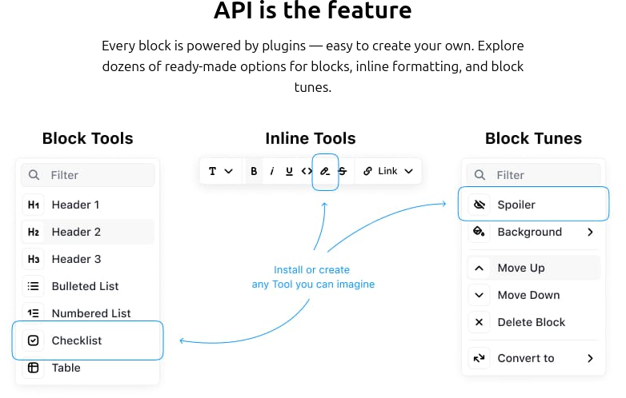
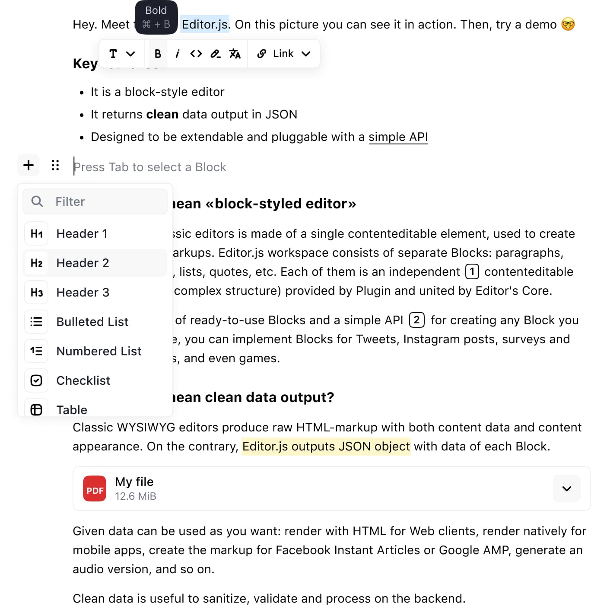
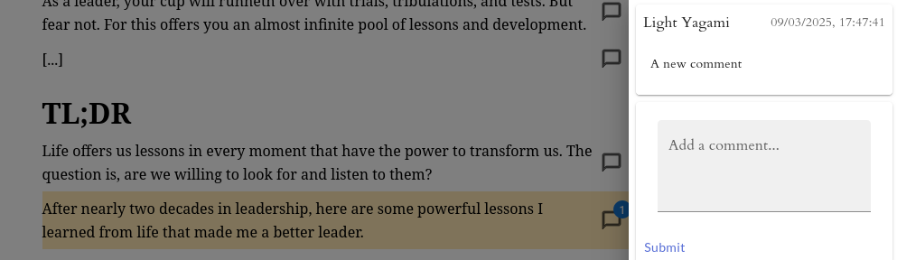
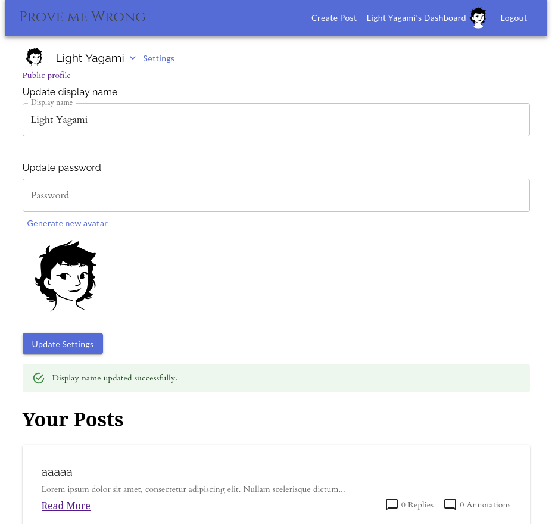

## Building Serverless Web Apps: 'Prove Me Wrong' – Collaborative Blog with Notion-like Blocks

<div style="max-width:500px; margin: auto">
    
</div>

### Why I Built "Prove Me Wrong"
I've always been drawn to platforms that facilitate thoughtful discussions and the exchange of ideas. After using Notion extensively and admiring its block-style editor, I wanted to create something similar but with a specific focus on constructive debate.
The idea behind "Prove Me Wrong" was to build a platform where:
1. Users could present arguments in a structured, visually appealing format
2. Others could challenge these ideas with evidence and reasoning
3. Logical fallacies could be identified and tagged
4. The best arguments would rise to the top based on quality, not just popularity

As someone who constantly works across different technologies, I saw this as an opportunity to push my JavaScript skills further and explore serverless architectures. The serverless approach was particularly appealing because it allowed me to focus on building features rather than managing infrastructure.

What started as a technical experiment evolved into a functional platform that demonstrated the power of combining modern web technologies. While similar to platforms like LessWrong in concept, "Prove Me Wrong" gave me hands-on experience with technologies I hadn't fully explored before.

The project served as both a learning experience and a playground for implementing ideas about how online discourse could be structured. Even though I ultimately paused development (for reasons I'll explain later), the journey of building it provided valuable insights into serverless architecture and JavaScript ecosystem integration.

### The Tech Stack Behind the Project

For my serverless web application [Prove Me Wrong](https://provemewrong.web.app/), I selected the following technologies:

- **[Gatsby](https://www.gatsbyjs.com/)**: A React-based framework for static site generation
- **[Firebase Authentication](https://firebase.google.com/products/auth)**: For user management and authentication flows
- **[Firebase Firestore](https://firebase.google.com/products/firestore)**: As the NoSQL database for content storage
- **[EditorJS](https://editorjs.io/)**: For implementing a block-style editor

> 💡 **Tech Reflection:** While Gatsby served its purpose, I recognize there are more current alternatives like [Next.js](https://nextjs.org/) or [Astro](https://astro.build/) that would be better choices for new projects today.

The combination of these technologies enabled me to create a functional serverless application without managing backend infrastructure.

### Finding the Right Editor Experience

<div style="max-width:500px; margin: auto">
    
</div>

The search for the perfect content editor was a journey in itself. After exploring various JavaScript packages and weighing their pros and cons, I eventually settled on EditorJS. Its block-based approach—similar to [Notion](https://www.notion.so/)'s interface—provided the foundation I needed.


<div style="max-width:500px; margin: auto">
    
</div>

*EditorJS allows for versatile content blocks similar to Notion*

What initially seemed like just one option among many now appears to be the obvious choice. EditorJS offered the right balance of flexibility and structure, allowing me to:

- Implement custom blocks and annotations
- Style the editing experience with custom CSS
- Create programmatic page generation tied to Firestore data

```javascript
// Example of a custom EditorJS block configuration
const annotatedParagraphConfig = {
  onSubmit: handleSubmit,
  postId: postId,
  currentBlockId: currentBlockId,
  handleOpenModel: handleOpenModal,
  onAnnotationClick: handleAnnotationClick,
}


class AnnotatedParagraph extends Paragraph {
  constructor({ data, api, config, block }) {
    // handle events, annotations on blocks, renders and sync to firestore
  }
}
const editorConfig = {
  holder: 'editorjs',
  tools: {
    header: {
      class: Header.default,
      inlineToolbar: ['link', 'bold', 'italic']
    },
    paragraph: {
      class: AnnotatedParagraph.default,
      config: annotatedParagraphConfig,
    },
    list: List.default,
  },
  onChange: async () => {
    // Sync content with Firestore
    await saveToFirestore(editor.save());
  }
};
```

<div style="max-width:500px; margin: auto">
    
</div>

*Example of the custom class AnnotatedParagraph, linking blocks to comments*

The JavaScript ecosystem offers numerous solutions for content editing, but EditorJS stood out for its extensibility and community support.

### User Experience Enhancements

Beyond the core editing functionality, I focused on crafting a seamless user experience:

- Implemented avatar generation for profile pictures
- Built a customizable display name system
- Designed intuitive authentication flows
- Created a dashboard displaying posts and comment counts

#### User Dashboard Preview

The main page showcases trending posts (currently populated with test content), providing a discovery mechanism for users to explore ideas.

<div style="max-width:500px; margin: auto">
    
</div>

*The dashboard provides quick access to the user's posts and engagement metrics*

### Technical Implementation Highlights

The project required adapting to various JavaScript patterns and frameworks. Some of the technical highlights include:

- **Real-time data synchronization** between EditorJS and Firestore
- **Custom React hooks** for managing authentication state
- **Firebase security rules** to protect user data
- **Gatsby page generation** from dynamic Firestore content

<details>
<summary>📌 **Example: Custom Authentication Hook**</summary>

```javascript
function useFirebaseAuth() {
  const [user, setUser] = useState(null);
  const [loading, setLoading] = useState(true);

  useEffect(() => {
    const unsubscribe = firebase.auth().onAuthStateChanged(user => {
      if (user) {
        // Fetch additional user data from Firestore
        firestore.collection('users').doc(user.uid)
          .get()
          .then(doc => {
            setUser({
              uid: user.uid,
              email: user.email,
              displayName: user.displayName || doc.data()?.displayName,
              ...doc.data()
            });
            setLoading(false);
          });
      } else {
        setUser(null);
        setLoading(false);
      }
    });

    return () => unsubscribe();
  }, []);

  return { user, loading };
}
```
</details>

These implementations demonstrated the versatility of modern JavaScript frameworks and serverless architectures, allowing for rapid development of feature-rich applications.

### Why I Paused Development

While I'm satisfied with what I built, I've paused further development for several reasons:

1. **Time investment**: Developing and maintaining such platforms is incredibly time-consuming, especially as a side project.

2. **Niche market**: Platforms focused on structured debate and idea exchange serve a relatively niche audience.

3. **Established competition**: Sites like [LessWrong](https://www.lesswrong.com/) already capture this audience effectively with features I had independently envisioned:
   - Refutation of ideas based on logical fallacies
   - Comprehensive tagging systems
   - Nested posting structures for threaded discussions

> 🤔 **Project Insight:** Recognizing when to pause a project is as important as knowing how to build it. The core technical challenges were solved, but the business and community aspects would require significant additional investment.

### Lessons for Serverless Development

For those looking to build similar applications, here are some key takeaways:

| Lesson | Description | Resources |
|--------|-------------|-----------|
| **Evaluate framework longevity** | Choose technologies that have ongoing support and development | [StateOfJS](https://stateofjs.com/), [npm trends](https://npmtrends.com/) |
| **Start with auth and data modeling** | Getting these fundamentals right early saves significant refactoring later | [Firebase Auth Docs](https://firebase.google.com/docs/auth), [NoSQL Data Modeling](https://firebase.google.com/docs/firestore/manage-data/structure-data) |
| **Consider the maintenance burden** | Serverless doesn't mean maintenance-free | [Serverless Monitoring](https://www.serverless.com/monitoring/) |
| **Validate the concept early** | Building the technology is only worthwhile if there's a clear use case and audience | [Lean Startup Methodology](http://theleanstartup.com/) |

### Try It Yourself

Want to see the platform in action? Here's a quick guide:

1. Visit [provemewrong.web.app](https://provemewrong.web.app/)
2. Create an account (only email required)
3. Create your first post using the block editor
4. Explore trending posts on the homepage

### Final Thoughts

"Prove Me Wrong" represents what's possible when combining modern JavaScript frameworks with serverless technologies. The project allowed me to adapt to different JavaScript ecosystems and implement features that would traditionally require significant backend infrastructure.

While this particular concept may remain in its current state, the technical knowledge gained has proven invaluable across other projects. The JavaScript ecosystem continues to evolve, and the adaptability required to navigate it remains one of the most valuable skills a developer can cultivate.

---

#### Related Projects and Inspiration

- [Notion](https://www.notion.so/) - The inspiration for the block editor concept
- [LessWrong](https://www.lesswrong.com/) - A community blog focused on rationality and reasoning
- [Gatsby Blog Starters](https://www.gatsbyjs.com/starters/?c=Blog) - Collection of Gatsby templates for content sites
